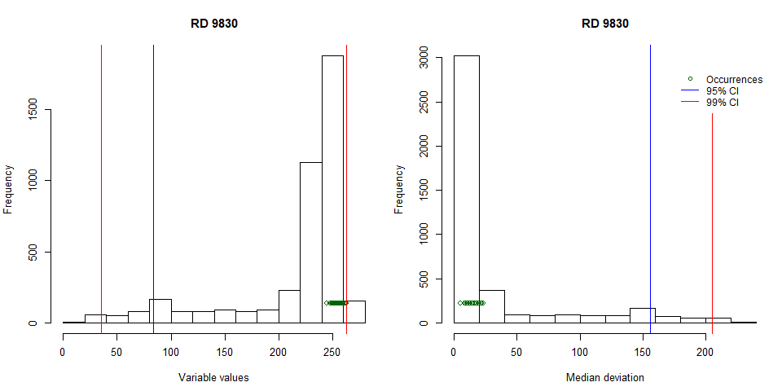
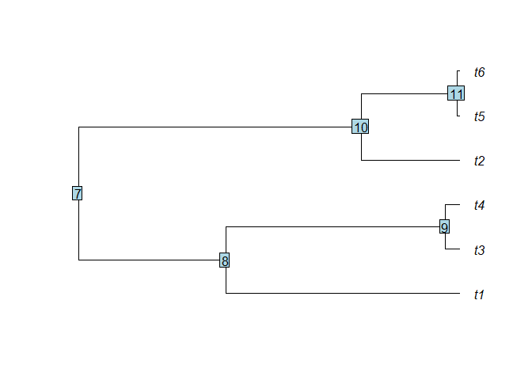
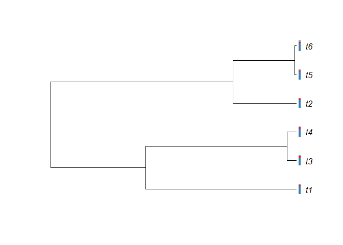
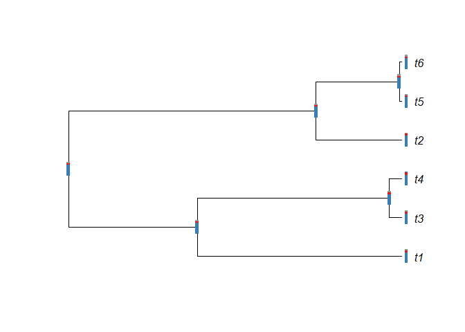
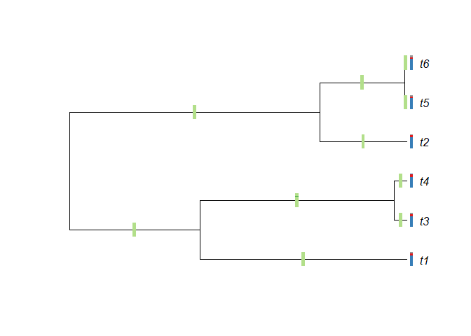
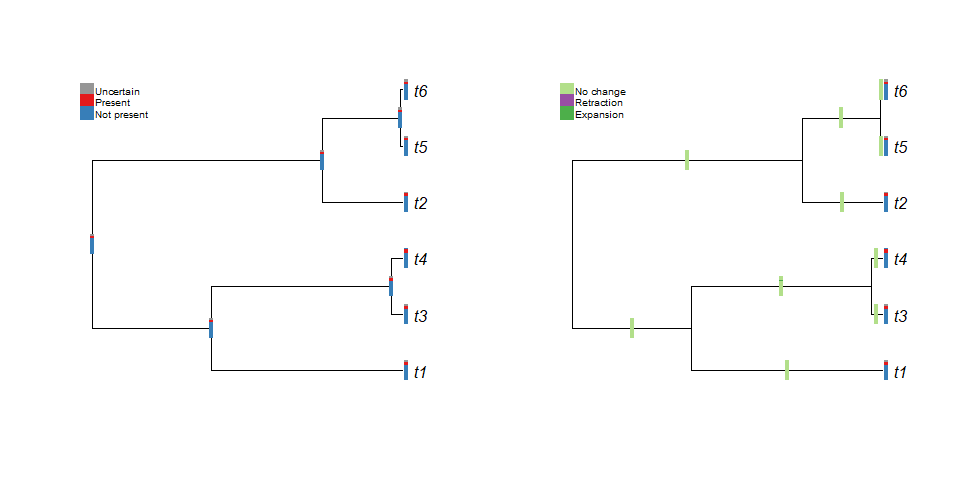

nichevol: Assessment of Species’ Ecological Niche Evolution Considering
Uncertainty in Reconstructions
================
Marlon E. Cobos, Hannah L. Owens, and A. Townsend Peterson

  - [Package description](#package-description)
  - [Installing the package](#installing-the-package)
      - [Stable version](#stable-version)
      - [Latest version](#latest-version)
  - [Exploring the nichevol package](#exploring-the-nichevol-package)
      - [Setting a directory](#setting-a-directory)
      - [Loading the package](#loading-the-package)
      - [Functions in nichevol](#functions-in-nichevol)
          - [Functions for data
            preparation](#functions-for-data-preparation)
          - [Functions for ancestral
            reconstruction](#functions-for-ancestral-reconstruction)
          - [Functions for post-reconstruction
            processes](#functions-for-post-reconstruction-processes)
          - [Functions for simulation of virtual
            species](#functions-for-simulation-of-virtual-species)
  - [Using nichevol with simple
    examples](#using-nichevol-with-simple-examples)
      - [Packages needed for data
        management](#packages-needed-for-data-management)
      - [Initial data (example data)](#initial-data-example-data)
      - [Preparing data for analyses](#preparing-data-for-analyses)
          - [Exploring data numerically](#exploring-data-numerically)
          - [Exploring data graphically](#exploring-data-graphically)
          - [Preparing tables of ecological niche
            characters](#preparing-tables-of-ecological-niche-characters)
      - [Ancestral reconstructions and smoothing of
        results](#ancestral-reconstructions-and-smoothing-of-results)
          - [Phylogenetic tree and data](#phylogenetic-tree-and-data)
          - [Maximum parsimony
            reconstruction](#maximum-parsimony-reconstruction)
          - [Maximum likelihood
            reconstruction](#maximum-likelihood-reconstruction)
      - [Representations of results](#representations-of-results)
          - [Ecological niches of our species in the
            phylogeny](#ecological-niches-of-our-species-in-the-phylogeny)
          - [Reconstructed ecological niches of
            ancestors](#reconstructed-ecological-niches-of-ancestors)
          - [Evolution of ecological niches in the
            group](#evolution-of-ecological-niches-in-the-group)
          - [A final, more informative
            plot](#a-final-more-informative-plot)
  - [References](#references)

<br>

<!-- badges: start -->

[](https://travis-ci.org/marlonecobos/nichevol)
<!-- badges: end -->

<hr>

## Package description

The **nichevol** R package helps to perform critical steps in the
process of assessment of species’ ecological niche evolution, with
uncertainty incorporated in reconstructions. The method proposed here
for ancestral reconstruction of ecological niches characterizes species’
niches using a bin-based approach that incorporates uncertainty in
estimations. Compared to other existent methods the approaches presented
here reduce risks of overestimation of ecological niche evolution.The
main analyses include: initial exploration of environmental data in
species records and accessible areas, preparation of data for
phylogenetic analyses, comparative phylogenetic analyses, and plotting
for interpretations.

<br>

<hr>

## Installing the package

### Stable version

The stable version of **nichevol** is in **CRAN** and it can be
installed and loaded using the code below (we are working on this):

``` r
if(!require(devtools)){
  install.packages("nichevol")
}
```

### Latest version

The most recent version of **nichevol** is available as a GitHub
repository and can be installed using the code below. Please, have in
mind that updates will be done on this version continuously.

Note: Try the code below first… If you have any problem during the
installation, restart your R session, close other sessions you may have
open, and try again. If during the installation you are asked to update
packages, please do it. If any of the packages gives an error, please
install it alone using install.packages(), then try re-installing
**nichevol** again. Also, it may be a good idea to update R and RStudio
(if you are using it).

``` r
# Installing and loading packages
if(!require(devtools)){
    install.packages("devtools")
}
if(!require(nichevol)){
    devtools::install_github("marlonecobos/nichevol")
}
```

<br>

<hr>

## Exploring the nichevol package

### Setting a directory

Some of the main functions of **nichevol** use data that need to be
loaded from a local directory and others produce results that need to be
written in a local directory. Loading data from a local directory and
writing the results outside the R environment helps to avoid problems
related to RAM limitations. That is why, setting a working directory is
recommended before starting, as follows:

``` r
directory <- "DRIVE:/YOUR/DIRECTORY" # change the characters accordingly
setwd(directory) 
```

<br>

### Loading the package

Once **nichevol** is installed you can load the package with the
following line.

``` r
library(nichevol)
```

<br>

### Functions in nichevol

Four main types of functions are included in **nichevol**: (1) the ones
that help in preparing data (exploration plots and tables of characters)
for ancestral reconstruction; (2) the ones that perform the ancestral
reconstructions (Maximum Parsimony and Maximum Likelihood); (3) some
complementary functions that help in performing post-reconstruction
steps (reconstruction smoothing, and niche and niche evolution
representations); and (4) the ones that help in producing virtual
species for exploring hypothesis. Of course, other helper functions are
used in the package but they won’t be used as commonly.

A complete list of the main functions in the **nichevol** package can be
found in the package documentation. Use the following code to see the
list.

``` r
help(nichevol)
```

<br>

#### Functions for data preparation

These functions are used to explore numerically and graphically how
environments in the areas accessible to the species (M) and in their
occurrences look like. They also help to prepare tables of characters
that represent species ecological niches considering used and non-used
conditions, as well as conditions where the use is uncertain. Most of
the functions in this module can be used to consider all species of
interest and multiple environmental variables at the time. For that
reason they read data from a local directory and have the option to
write results in such directories as well. The functions that work with
data from the R environment are the ones specifically designed to work
with multiple species but only one variable. These last functions do not
write results in local directories. We have intentionally designed some
of our functions to work interacting with local directories to avoid
RAM-related limitations (specially when working with multiple
environmental raster layers at high resolution).

#### Functions for ancestral reconstruction

This module contains functions that help in performing ancestral
reconstruction of species ecological niches. These functions use as
inputs the results of the ones from the previous module (tables of
characters) and phylogenetic trees as in objects of class “phylo” (see
the package **ape**). There are two types of reconstructions available
to date (Maximum Likelihood and Maximum Parsimony), but at least other
type will be included. All these functions use inputs and produce
outputs in the R environment.

#### Functions for post-reconstruction processes

Functions in this module are intended to help with two main processes.
First, one of these functions helps in smoothing results from ancestral
reconstructions. This is necessary to prevent misinterpretations of
results from comparing reconstructed niches of ancestors with niches of
descendants (younger ancestors or taxa of interest). Second, other
functions help in representing results of previous analyses. For
instance, they help in producing bar-like labels that represent the
niche of a species, or, they can also be used to represent how niches
have evolved across the phylogeny.

#### Functions for simulation of virtual species

These module is still under development but it is intended to help in
creating a suit of virtual species niches and their phylogenetic
relationships to explore hypothesis of niche evolution.

<br>

<hr>

## Using nichevol with simple examples

### Packages needed for data management

The following packages are needed for specific tasks. They are used
internally by **nichevol** but parts of these code will require them.
Notice that **nichevol** is already loaded but these other packages need
to be loaded separately.

``` r
library(raster) # for reading environmental layers
library(rgdal) # for reading shapefiles
library(ape) # for plotting phylogenetic trees and node labels
library(geiger) # for merging a phylogenetic tree with a table of niche characters
```

### Initial data (example data)

The following lines of code will help to get example data prepared for
demonstrating the usage of **nichevol**. These data were used in an
article in which the methods implemented in **nichevol** were proposed,
illustrated, and explained (see Owens et al. in review). These data are
included in the package, so its use is straightforward.

``` r
# variable at coarse resolution to be used as example only
temp <- getData("worldclim", var = "bio", res = 10)[[1]]

# examples of species accessible areas
data("m_list", package = "nichevol")

# examples of species occurrences
data("occ_list", package = "nichevol")

# a simple phylogenetic tree for demonstrations
data("tree", package = "nichevol")

# a table of charaters representing species ecological niches derived from bin_table
data("character_table", package = "nichevol")

# a list that matches the tree with the character table 
data("tree_data", package = "nichevol")
```

<br>

### Preparing data for analyses

Before starting playing with the functions consider that **nichevol**
allows distinct ways to prepare data depending on the user needs. The
example data downloaded before can be used with the functions designed
to work with multiple variables and all taxa at the time
(*histograms\_env*, *stats\_evalues*, *bin\_tables*, *bin\_tables0*). We
will see examples with these options first, but examples with the
functions that work with data in the R environment and only for one
variable at the time are also shown.

#### Exploring data numerically

**Multiple variables**

First check the help:

``` r
help(stats_evalues)
```

Now the
running:

``` r
stats <- stats_evalues(stats = c("mean", "sd", "median", "range", "quantile"), 
                       M_folder = "Folder_with_Ms", M_format = "shp", 
                       occ_folder = "Folder_with_occs", longitude = "lon_column", 
                       latitude = "lat_column", var_folder = "Folder_with_vars", 
                       var_format = "GTiff", percentage_out = 0)
```

**One variable**

First check the help:

``` r
help(stats_eval)
```

Now the
running:

``` r
stat <- stats_eval(stats = c("mean", "sd", "median", "range", "quantile"), 
                   Ms = m_list, occurrences = occ_list, species = "species",
                   longitude = "x", latitude = "y", variable = temp, 
                   percentage_out = 0)
#> Preparing statistics from environmental layer and species data:
#>   1 of 6 species finished
#>   2 of 6 species finished
#>   3 of 6 species finished
#>   4 of 6 species finished
#>   5 of 6 species finished
#>   6 of 6 species finished

knitr::kable(stat[[1]], caption = "Table of descriptive statistics of temperature (x 10) in accessible areas for the species of interest.", digits = 2) %>% kable_styling(font_size = 12)
```

<table class="table" style="font-size: 12px; margin-left: auto; margin-right: auto;">

<caption style="font-size: initial !important;">

Table of descriptive statistics of temperature (x 10) in accessible
areas for the species of interest.

</caption>

<thead>

<tr>

<th style="text-align:left;">

Species

</th>

<th style="text-align:right;">

mean

</th>

<th style="text-align:right;">

sd

</th>

<th style="text-align:right;">

median

</th>

<th style="text-align:right;">

range1

</th>

<th style="text-align:right;">

range2

</th>

<th style="text-align:right;">

quantile.0.

</th>

<th style="text-align:right;">

quantile.25.

</th>

<th style="text-align:right;">

quantile.50.

</th>

<th style="text-align:right;">

quantile.75.

</th>

<th style="text-align:right;">

quantile.100.

</th>

</tr>

</thead>

<tbody>

<tr>

<td style="text-align:left;">

RD 9830

</td>

<td style="text-align:right;">

218.47

</td>

<td style="text-align:right;">

55.10

</td>

<td style="text-align:right;">

240

</td>

<td style="text-align:right;">

14

</td>

<td style="text-align:right;">

263

</td>

<td style="text-align:right;">

14

</td>

<td style="text-align:right;">

223.00

</td>

<td style="text-align:right;">

240

</td>

<td style="text-align:right;">

249

</td>

<td style="text-align:right;">

263

</td>

</tr>

<tr>

<td style="text-align:left;">

RD 3351

</td>

<td style="text-align:right;">

244.63

</td>

<td style="text-align:right;">

14.78

</td>

<td style="text-align:right;">

249

</td>

<td style="text-align:right;">

175

</td>

<td style="text-align:right;">

272

</td>

<td style="text-align:right;">

175

</td>

<td style="text-align:right;">

237.00

</td>

<td style="text-align:right;">

249

</td>

<td style="text-align:right;">

254

</td>

<td style="text-align:right;">

272

</td>

</tr>

<tr>

<td style="text-align:left;">

RD 6933

</td>

<td style="text-align:right;">

152.98

</td>

<td style="text-align:right;">

76.81

</td>

<td style="text-align:right;">

168

</td>

<td style="text-align:right;">

\-1

</td>

<td style="text-align:right;">

269

</td>

<td style="text-align:right;">

\-1

</td>

<td style="text-align:right;">

80.75

</td>

<td style="text-align:right;">

168

</td>

<td style="text-align:right;">

215

</td>

<td style="text-align:right;">

269

</td>

</tr>

<tr>

<td style="text-align:left;">

RD 761

</td>

<td style="text-align:right;">

222.27

</td>

<td style="text-align:right;">

52.65

</td>

<td style="text-align:right;">

238

</td>

<td style="text-align:right;">

\-27

</td>

<td style="text-align:right;">

263

</td>

<td style="text-align:right;">

\-27

</td>

<td style="text-align:right;">

227.00

</td>

<td style="text-align:right;">

238

</td>

<td style="text-align:right;">

249

</td>

<td style="text-align:right;">

263

</td>

</tr>

<tr>

<td style="text-align:left;">

RD 6773

</td>

<td style="text-align:right;">

245.29

</td>

<td style="text-align:right;">

10.69

</td>

<td style="text-align:right;">

248

</td>

<td style="text-align:right;">

160

</td>

<td style="text-align:right;">

269

</td>

<td style="text-align:right;">

160

</td>

<td style="text-align:right;">

240.00

</td>

<td style="text-align:right;">

248

</td>

<td style="text-align:right;">

252

</td>

<td style="text-align:right;">

269

</td>

</tr>

<tr>

<td style="text-align:left;">

RD 7516

</td>

<td style="text-align:right;">

211.02

</td>

<td style="text-align:right;">

78.19

</td>

<td style="text-align:right;">

256

</td>

<td style="text-align:right;">

\-31

</td>

<td style="text-align:right;">

288

</td>

<td style="text-align:right;">

\-31

</td>

<td style="text-align:right;">

165.75

</td>

<td style="text-align:right;">

256

</td>

<td style="text-align:right;">

261

</td>

<td style="text-align:right;">

288

</td>

</tr>

</tbody>

</table>

``` r

knitr::kable(stat[[2]], caption = "Table of descriptive statistics of temperature (x 10) in occurrences of the species of interest.", digits = 2) %>% kable_styling(font_size = 12)
```

<table class="table" style="font-size: 12px; margin-left: auto; margin-right: auto;">

<caption style="font-size: initial !important;">

Table of descriptive statistics of temperature (x 10) in occurrences of
the species of interest.

</caption>

<thead>

<tr>

<th style="text-align:left;">

Species

</th>

<th style="text-align:right;">

mean

</th>

<th style="text-align:right;">

sd

</th>

<th style="text-align:right;">

median

</th>

<th style="text-align:right;">

range1

</th>

<th style="text-align:right;">

range2

</th>

<th style="text-align:right;">

quantile.0.

</th>

<th style="text-align:right;">

quantile.25.

</th>

<th style="text-align:right;">

quantile.50.

</th>

<th style="text-align:right;">

quantile.75.

</th>

<th style="text-align:right;">

quantile.100.

</th>

</tr>

</thead>

<tbody>

<tr>

<td style="text-align:left;">

RD 9830

</td>

<td style="text-align:right;">

255.57

</td>

<td style="text-align:right;">

4.28

</td>

<td style="text-align:right;">

255

</td>

<td style="text-align:right;">

245

</td>

<td style="text-align:right;">

263

</td>

<td style="text-align:right;">

245

</td>

<td style="text-align:right;">

252

</td>

<td style="text-align:right;">

255

</td>

<td style="text-align:right;">

259

</td>

<td style="text-align:right;">

263

</td>

</tr>

<tr>

<td style="text-align:left;">

RD 3351

</td>

<td style="text-align:right;">

254.93

</td>

<td style="text-align:right;">

4.12

</td>

<td style="text-align:right;">

254

</td>

<td style="text-align:right;">

244

</td>

<td style="text-align:right;">

266

</td>

<td style="text-align:right;">

244

</td>

<td style="text-align:right;">

252

</td>

<td style="text-align:right;">

254

</td>

<td style="text-align:right;">

258

</td>

<td style="text-align:right;">

266

</td>

</tr>

<tr>

<td style="text-align:left;">

RD 6933

</td>

<td style="text-align:right;">

259.94

</td>

<td style="text-align:right;">

5.27

</td>

<td style="text-align:right;">

260

</td>

<td style="text-align:right;">

243

</td>

<td style="text-align:right;">

269

</td>

<td style="text-align:right;">

243

</td>

<td style="text-align:right;">

256

</td>

<td style="text-align:right;">

260

</td>

<td style="text-align:right;">

264

</td>

<td style="text-align:right;">

269

</td>

</tr>

<tr>

<td style="text-align:left;">

RD 761

</td>

<td style="text-align:right;">

255.42

</td>

<td style="text-align:right;">

4.28

</td>

<td style="text-align:right;">

255

</td>

<td style="text-align:right;">

246

</td>

<td style="text-align:right;">

263

</td>

<td style="text-align:right;">

246

</td>

<td style="text-align:right;">

251

</td>

<td style="text-align:right;">

255

</td>

<td style="text-align:right;">

259

</td>

<td style="text-align:right;">

263

</td>

</tr>

<tr>

<td style="text-align:left;">

RD 6773

</td>

<td style="text-align:right;">

250.14

</td>

<td style="text-align:right;">

5.17

</td>

<td style="text-align:right;">

250

</td>

<td style="text-align:right;">

240

</td>

<td style="text-align:right;">

268

</td>

<td style="text-align:right;">

240

</td>

<td style="text-align:right;">

247

</td>

<td style="text-align:right;">

250

</td>

<td style="text-align:right;">

253

</td>

<td style="text-align:right;">

268

</td>

</tr>

<tr>

<td style="text-align:left;">

RD 7516

</td>

<td style="text-align:right;">

259.09

</td>

<td style="text-align:right;">

6.30

</td>

<td style="text-align:right;">

260

</td>

<td style="text-align:right;">

241

</td>

<td style="text-align:right;">

278

</td>

<td style="text-align:right;">

241

</td>

<td style="text-align:right;">

256

</td>

<td style="text-align:right;">

260

</td>

<td style="text-align:right;">

263

</td>

<td style="text-align:right;">

278

</td>

</tr>

</tbody>

</table>

<br>

#### Exploring data graphically

**Multiple variables**

First check the help:

``` r
help(histograms_env)
```

Now the running:

``` r
hists <- histograms_env(M_folder = "Folder_with_Ms", M_format = "shp",
                        occ_folder = "Folder_with_occs", longitude = "lon_column",
                        latitude = "lat_column", var_folder = "Folder_with_vars",
                        var_format = "GTiff")
```

**One variable**

First check the help:

``` r
help(hist_evalues)
```

Now the
running:

``` r
hist_evalues(M = m_list[[1]], occurrences = occ_list[[1]], species = "species", 
             longitude = "x", latitude = "y", variable = temp,
             CL_lines = c(95, 99), col = c("blue", "red"))
```

<!-- -->

<br>

#### Preparing tables of ecological niche characters

**Multiple variables: When using ranges obtained in histograms**

First check the help:

``` r
help(bin_tables)
```

Now the running:

``` r
bins <- bin_tables(ranges, percentage_out = 5, bin_size = 10)
```

**Multiple variables: When using data from local directory**

First check the help:

``` r
help(bin_tables0)
```

Now the running:

``` r
bins <- bin_tables0(M_folder = "Folder_with_Ms", M_format = "shp",
                    occ_folder = "Folder_with_occs", longitude = "lon_column",
                    latitude = "lat_column", var_folder = "Folder_with_vars",
                    var_format = "GTiff", percentage_out = 5, bin_size = 10)
```

**One variables: When using data from the R environment**

First check the help:

``` r
help(bin_table)
```

Now the
running:

``` r
bin_tabl <- bin_table(Ms = m_list, occurrences = occ_list, species = "species",
                      longitude = "x", latitude = "y", variable = temp, 
                      percentage_out = 5, bin_size = 10)
#> 
#>    Preparing range values:
#>   1 of 6 species finished
#>   2 of 6 species finished
#>   3 of 6 species finished
#>   4 of 6 species finished
#>   5 of 6 species finished
#>   6 of 6 species finished
#>    Preparing bin tables using ranges:
#>   1 of 6 species finished
#>   2 of 6 species finished
#>   3 of 6 species finished
#>   4 of 6 species finished
#>   5 of 6 species finished
#>   6 of 6 species finished

knitr::kable(bin_tabl, caption = "Table characters for ecological niches of the species of interest.") %>% 
  kable_styling(font_size = 12)
```

<table class="table" style="font-size: 12px; margin-left: auto; margin-right: auto;">

<caption style="font-size: initial !important;">

Table characters for ecological niches of the species of interest.

</caption>

<thead>

<tr>

<th style="text-align:left;">

</th>

<th style="text-align:left;">

20 to 30

</th>

<th style="text-align:left;">

31 to 40

</th>

<th style="text-align:left;">

41 to 50

</th>

<th style="text-align:left;">

51 to 60

</th>

<th style="text-align:left;">

61 to 70

</th>

<th style="text-align:left;">

71 to 80

</th>

<th style="text-align:left;">

81 to 90

</th>

<th style="text-align:left;">

91 to 100

</th>

<th style="text-align:left;">

101 to 110

</th>

<th style="text-align:left;">

111 to 120

</th>

<th style="text-align:left;">

121 to 130

</th>

<th style="text-align:left;">

131 to 140

</th>

<th style="text-align:left;">

141 to 150

</th>

<th style="text-align:left;">

151 to 160

</th>

<th style="text-align:left;">

161 to 170

</th>

<th style="text-align:left;">

171 to 180

</th>

<th style="text-align:left;">

181 to 190

</th>

<th style="text-align:left;">

191 to 200

</th>

<th style="text-align:left;">

201 to 210

</th>

<th style="text-align:left;">

211 to 220

</th>

<th style="text-align:left;">

221 to 230

</th>

<th style="text-align:left;">

231 to 240

</th>

<th style="text-align:left;">

241 to 250

</th>

<th style="text-align:left;">

251 to 260

</th>

<th style="text-align:left;">

261 to 270

</th>

<th style="text-align:left;">

271 to 280

</th>

<th style="text-align:left;">

281 to 290

</th>

<th style="text-align:left;">

291 to 300

</th>

</tr>

</thead>

<tbody>

<tr>

<td style="text-align:left;">

RD 9830

</td>

<td style="text-align:left;">

0

</td>

<td style="text-align:left;">

0

</td>

<td style="text-align:left;">

0

</td>

<td style="text-align:left;">

0

</td>

<td style="text-align:left;">

0

</td>

<td style="text-align:left;">

0

</td>

<td style="text-align:left;">

0

</td>

<td style="text-align:left;">

0

</td>

<td style="text-align:left;">

0

</td>

<td style="text-align:left;">

0

</td>

<td style="text-align:left;">

0

</td>

<td style="text-align:left;">

0

</td>

<td style="text-align:left;">

0

</td>

<td style="text-align:left;">

0

</td>

<td style="text-align:left;">

0

</td>

<td style="text-align:left;">

0

</td>

<td style="text-align:left;">

0

</td>

<td style="text-align:left;">

0

</td>

<td style="text-align:left;">

0

</td>

<td style="text-align:left;">

0

</td>

<td style="text-align:left;">

0

</td>

<td style="text-align:left;">

0

</td>

<td style="text-align:left;">

1

</td>

<td style="text-align:left;">

1

</td>

<td style="text-align:left;">

1

</td>

<td style="text-align:left;">

?

</td>

<td style="text-align:left;">

?

</td>

<td style="text-align:left;">

?

</td>

</tr>

<tr>

<td style="text-align:left;">

RD 3351

</td>

<td style="text-align:left;">

0

</td>

<td style="text-align:left;">

0

</td>

<td style="text-align:left;">

0

</td>

<td style="text-align:left;">

0

</td>

<td style="text-align:left;">

0

</td>

<td style="text-align:left;">

0

</td>

<td style="text-align:left;">

0

</td>

<td style="text-align:left;">

0

</td>

<td style="text-align:left;">

0

</td>

<td style="text-align:left;">

0

</td>

<td style="text-align:left;">

0

</td>

<td style="text-align:left;">

0

</td>

<td style="text-align:left;">

0

</td>

<td style="text-align:left;">

0

</td>

<td style="text-align:left;">

0

</td>

<td style="text-align:left;">

0

</td>

<td style="text-align:left;">

0

</td>

<td style="text-align:left;">

0

</td>

<td style="text-align:left;">

0

</td>

<td style="text-align:left;">

0

</td>

<td style="text-align:left;">

0

</td>

<td style="text-align:left;">

0

</td>

<td style="text-align:left;">

1

</td>

<td style="text-align:left;">

1

</td>

<td style="text-align:left;">

1

</td>

<td style="text-align:left;">

0

</td>

<td style="text-align:left;">

0

</td>

<td style="text-align:left;">

0

</td>

</tr>

<tr>

<td style="text-align:left;">

RD 6933

</td>

<td style="text-align:left;">

0

</td>

<td style="text-align:left;">

0

</td>

<td style="text-align:left;">

0

</td>

<td style="text-align:left;">

0

</td>

<td style="text-align:left;">

0

</td>

<td style="text-align:left;">

0

</td>

<td style="text-align:left;">

0

</td>

<td style="text-align:left;">

0

</td>

<td style="text-align:left;">

0

</td>

<td style="text-align:left;">

0

</td>

<td style="text-align:left;">

0

</td>

<td style="text-align:left;">

0

</td>

<td style="text-align:left;">

0

</td>

<td style="text-align:left;">

0

</td>

<td style="text-align:left;">

0

</td>

<td style="text-align:left;">

0

</td>

<td style="text-align:left;">

0

</td>

<td style="text-align:left;">

0

</td>

<td style="text-align:left;">

0

</td>

<td style="text-align:left;">

0

</td>

<td style="text-align:left;">

0

</td>

<td style="text-align:left;">

0

</td>

<td style="text-align:left;">

1

</td>

<td style="text-align:left;">

1

</td>

<td style="text-align:left;">

1

</td>

<td style="text-align:left;">

?

</td>

<td style="text-align:left;">

?

</td>

<td style="text-align:left;">

?

</td>

</tr>

<tr>

<td style="text-align:left;">

RD 761

</td>

<td style="text-align:left;">

0

</td>

<td style="text-align:left;">

0

</td>

<td style="text-align:left;">

0

</td>

<td style="text-align:left;">

0

</td>

<td style="text-align:left;">

0

</td>

<td style="text-align:left;">

0

</td>

<td style="text-align:left;">

0

</td>

<td style="text-align:left;">

0

</td>

<td style="text-align:left;">

0

</td>

<td style="text-align:left;">

0

</td>

<td style="text-align:left;">

0

</td>

<td style="text-align:left;">

0

</td>

<td style="text-align:left;">

0

</td>

<td style="text-align:left;">

0

</td>

<td style="text-align:left;">

0

</td>

<td style="text-align:left;">

0

</td>

<td style="text-align:left;">

0

</td>

<td style="text-align:left;">

0

</td>

<td style="text-align:left;">

0

</td>

<td style="text-align:left;">

0

</td>

<td style="text-align:left;">

0

</td>

<td style="text-align:left;">

0

</td>

<td style="text-align:left;">

1

</td>

<td style="text-align:left;">

1

</td>

<td style="text-align:left;">

1

</td>

<td style="text-align:left;">

?

</td>

<td style="text-align:left;">

?

</td>

<td style="text-align:left;">

?

</td>

</tr>

<tr>

<td style="text-align:left;">

RD 6773

</td>

<td style="text-align:left;">

0

</td>

<td style="text-align:left;">

0

</td>

<td style="text-align:left;">

0

</td>

<td style="text-align:left;">

0

</td>

<td style="text-align:left;">

0

</td>

<td style="text-align:left;">

0

</td>

<td style="text-align:left;">

0

</td>

<td style="text-align:left;">

0

</td>

<td style="text-align:left;">

0

</td>

<td style="text-align:left;">

0

</td>

<td style="text-align:left;">

0

</td>

<td style="text-align:left;">

0

</td>

<td style="text-align:left;">

0

</td>

<td style="text-align:left;">

0

</td>

<td style="text-align:left;">

0

</td>

<td style="text-align:left;">

0

</td>

<td style="text-align:left;">

0

</td>

<td style="text-align:left;">

0

</td>

<td style="text-align:left;">

0

</td>

<td style="text-align:left;">

0

</td>

<td style="text-align:left;">

0

</td>

<td style="text-align:left;">

1

</td>

<td style="text-align:left;">

1

</td>

<td style="text-align:left;">

1

</td>

<td style="text-align:left;">

1

</td>

<td style="text-align:left;">

?

</td>

<td style="text-align:left;">

?

</td>

<td style="text-align:left;">

?

</td>

</tr>

<tr>

<td style="text-align:left;">

RD 7516

</td>

<td style="text-align:left;">

0

</td>

<td style="text-align:left;">

0

</td>

<td style="text-align:left;">

0

</td>

<td style="text-align:left;">

0

</td>

<td style="text-align:left;">

0

</td>

<td style="text-align:left;">

0

</td>

<td style="text-align:left;">

0

</td>

<td style="text-align:left;">

0

</td>

<td style="text-align:left;">

0

</td>

<td style="text-align:left;">

0

</td>

<td style="text-align:left;">

0

</td>

<td style="text-align:left;">

0

</td>

<td style="text-align:left;">

0

</td>

<td style="text-align:left;">

0

</td>

<td style="text-align:left;">

0

</td>

<td style="text-align:left;">

0

</td>

<td style="text-align:left;">

0

</td>

<td style="text-align:left;">

0

</td>

<td style="text-align:left;">

0

</td>

<td style="text-align:left;">

0

</td>

<td style="text-align:left;">

0

</td>

<td style="text-align:left;">

0

</td>

<td style="text-align:left;">

1

</td>

<td style="text-align:left;">

1

</td>

<td style="text-align:left;">

1

</td>

<td style="text-align:left;">

1

</td>

<td style="text-align:left;">

0

</td>

<td style="text-align:left;">

0

</td>

</tr>

</tbody>

</table>

<br>

### Ancestral reconstructions and smoothing of results

These functions work with one variable at the time, but users can
perform several analyses in loop if needed. The variable to be explored
here is temperature.

#### Phylogenetic tree and data

With the following code, the phylogenetic tree will be plotted and its
nodes will be added.

``` r
# exploring tree
plot.phylo(tree, label.offset = 0.04)
nodelabels()
```

<!-- -->

<br>

#### Maximum parsimony reconstruction

First check the help:

``` r
help(bin_par_rec)
help(smooth_rec)
```

Now the running:

``` r
# reconstruction
par_rec_table <- bin_par_rec(tree_data)

# smoothing
s_par_rec_table <- smooth_rec(par_rec_table)

# results
knitr::kable(s_par_rec_table, caption = "Table characters for ecological niches of the species of interest and maximum parsimony reconstructions for their ancestors.") %>% kable_styling(font_size = 12)
```

<table class="table" style="font-size: 12px; margin-left: auto; margin-right: auto;">

<caption style="font-size: initial !important;">

Table characters for ecological niches of the species of interest and
maximum parsimony reconstructions for their ancestors.

</caption>

<thead>

<tr>

<th style="text-align:left;">

</th>

<th style="text-align:left;">

21 to 30

</th>

<th style="text-align:left;">

31 to 40

</th>

<th style="text-align:left;">

41 to 50

</th>

<th style="text-align:left;">

51 to 60

</th>

<th style="text-align:left;">

61 to 70

</th>

<th style="text-align:left;">

71 to 80

</th>

<th style="text-align:left;">

81 to 90

</th>

<th style="text-align:left;">

91 to 100

</th>

<th style="text-align:left;">

101 to 110

</th>

<th style="text-align:left;">

111 to 120

</th>

<th style="text-align:left;">

121 to 130

</th>

<th style="text-align:left;">

131 to 140

</th>

<th style="text-align:left;">

141 to 150

</th>

<th style="text-align:left;">

151 to 160

</th>

<th style="text-align:left;">

161 to 170

</th>

<th style="text-align:left;">

171 to 180

</th>

<th style="text-align:left;">

181 to 190

</th>

<th style="text-align:left;">

191 to 200

</th>

<th style="text-align:left;">

201 to 210

</th>

<th style="text-align:left;">

211 to 220

</th>

<th style="text-align:left;">

221 to 230

</th>

<th style="text-align:left;">

231 to 240

</th>

<th style="text-align:left;">

241 to 250

</th>

<th style="text-align:left;">

251 to 260

</th>

<th style="text-align:left;">

261 to 270

</th>

<th style="text-align:left;">

271 to 280

</th>

<th style="text-align:left;">

281 to 290

</th>

<th style="text-align:left;">

291 to 300

</th>

</tr>

</thead>

<tbody>

<tr>

<td style="text-align:left;">

t1

</td>

<td style="text-align:left;">

0

</td>

<td style="text-align:left;">

0

</td>

<td style="text-align:left;">

0

</td>

<td style="text-align:left;">

0

</td>

<td style="text-align:left;">

0

</td>

<td style="text-align:left;">

0

</td>

<td style="text-align:left;">

0

</td>

<td style="text-align:left;">

0

</td>

<td style="text-align:left;">

0

</td>

<td style="text-align:left;">

0

</td>

<td style="text-align:left;">

0

</td>

<td style="text-align:left;">

0

</td>

<td style="text-align:left;">

0

</td>

<td style="text-align:left;">

0

</td>

<td style="text-align:left;">

0

</td>

<td style="text-align:left;">

0

</td>

<td style="text-align:left;">

0

</td>

<td style="text-align:left;">

0

</td>

<td style="text-align:left;">

0

</td>

<td style="text-align:left;">

0

</td>

<td style="text-align:left;">

0

</td>

<td style="text-align:left;">

0

</td>

<td style="text-align:left;">

1

</td>

<td style="text-align:left;">

1

</td>

<td style="text-align:left;">

1

</td>

<td style="text-align:left;">

?

</td>

<td style="text-align:left;">

?

</td>

<td style="text-align:left;">

?

</td>

</tr>

<tr>

<td style="text-align:left;">

t2

</td>

<td style="text-align:left;">

0

</td>

<td style="text-align:left;">

0

</td>

<td style="text-align:left;">

0

</td>

<td style="text-align:left;">

0

</td>

<td style="text-align:left;">

0

</td>

<td style="text-align:left;">

0

</td>

<td style="text-align:left;">

0

</td>

<td style="text-align:left;">

0

</td>

<td style="text-align:left;">

0

</td>

<td style="text-align:left;">

0

</td>

<td style="text-align:left;">

0

</td>

<td style="text-align:left;">

0

</td>

<td style="text-align:left;">

0

</td>

<td style="text-align:left;">

0

</td>

<td style="text-align:left;">

0

</td>

<td style="text-align:left;">

0

</td>

<td style="text-align:left;">

0

</td>

<td style="text-align:left;">

0

</td>

<td style="text-align:left;">

0

</td>

<td style="text-align:left;">

0

</td>

<td style="text-align:left;">

0

</td>

<td style="text-align:left;">

0

</td>

<td style="text-align:left;">

1

</td>

<td style="text-align:left;">

1

</td>

<td style="text-align:left;">

1

</td>

<td style="text-align:left;">

1

</td>

<td style="text-align:left;">

?

</td>

<td style="text-align:left;">

?

</td>

</tr>

<tr>

<td style="text-align:left;">

t5

</td>

<td style="text-align:left;">

0

</td>

<td style="text-align:left;">

0

</td>

<td style="text-align:left;">

0

</td>

<td style="text-align:left;">

0

</td>

<td style="text-align:left;">

0

</td>

<td style="text-align:left;">

0

</td>

<td style="text-align:left;">

0

</td>

<td style="text-align:left;">

0

</td>

<td style="text-align:left;">

0

</td>

<td style="text-align:left;">

0

</td>

<td style="text-align:left;">

0

</td>

<td style="text-align:left;">

0

</td>

<td style="text-align:left;">

0

</td>

<td style="text-align:left;">

0

</td>

<td style="text-align:left;">

0

</td>

<td style="text-align:left;">

0

</td>

<td style="text-align:left;">

0

</td>

<td style="text-align:left;">

0

</td>

<td style="text-align:left;">

0

</td>

<td style="text-align:left;">

0

</td>

<td style="text-align:left;">

0

</td>

<td style="text-align:left;">

0

</td>

<td style="text-align:left;">

1

</td>

<td style="text-align:left;">

1

</td>

<td style="text-align:left;">

1

</td>

<td style="text-align:left;">

?

</td>

<td style="text-align:left;">

?

</td>

<td style="text-align:left;">

?

</td>

</tr>

<tr>

<td style="text-align:left;">

t6

</td>

<td style="text-align:left;">

0

</td>

<td style="text-align:left;">

0

</td>

<td style="text-align:left;">

0

</td>

<td style="text-align:left;">

0

</td>

<td style="text-align:left;">

0

</td>

<td style="text-align:left;">

0

</td>

<td style="text-align:left;">

0

</td>

<td style="text-align:left;">

0

</td>

<td style="text-align:left;">

0

</td>

<td style="text-align:left;">

0

</td>

<td style="text-align:left;">

0

</td>

<td style="text-align:left;">

0

</td>

<td style="text-align:left;">

0

</td>

<td style="text-align:left;">

0

</td>

<td style="text-align:left;">

0

</td>

<td style="text-align:left;">

0

</td>

<td style="text-align:left;">

0

</td>

<td style="text-align:left;">

0

</td>

<td style="text-align:left;">

0

</td>

<td style="text-align:left;">

0

</td>

<td style="text-align:left;">

0

</td>

<td style="text-align:left;">

0

</td>

<td style="text-align:left;">

1

</td>

<td style="text-align:left;">

1

</td>

<td style="text-align:left;">

1

</td>

<td style="text-align:left;">

?

</td>

<td style="text-align:left;">

?

</td>

<td style="text-align:left;">

?

</td>

</tr>

<tr>

<td style="text-align:left;">

t3

</td>

<td style="text-align:left;">

0

</td>

<td style="text-align:left;">

0

</td>

<td style="text-align:left;">

0

</td>

<td style="text-align:left;">

0

</td>

<td style="text-align:left;">

0

</td>

<td style="text-align:left;">

0

</td>

<td style="text-align:left;">

0

</td>

<td style="text-align:left;">

0

</td>

<td style="text-align:left;">

0

</td>

<td style="text-align:left;">

0

</td>

<td style="text-align:left;">

0

</td>

<td style="text-align:left;">

0

</td>

<td style="text-align:left;">

0

</td>

<td style="text-align:left;">

0

</td>

<td style="text-align:left;">

0

</td>

<td style="text-align:left;">

0

</td>

<td style="text-align:left;">

0

</td>

<td style="text-align:left;">

0

</td>

<td style="text-align:left;">

0

</td>

<td style="text-align:left;">

0

</td>

<td style="text-align:left;">

0

</td>

<td style="text-align:left;">

1

</td>

<td style="text-align:left;">

1

</td>

<td style="text-align:left;">

1

</td>

<td style="text-align:left;">

1

</td>

<td style="text-align:left;">

?

</td>

<td style="text-align:left;">

?

</td>

<td style="text-align:left;">

?

</td>

</tr>

<tr>

<td style="text-align:left;">

t4

</td>

<td style="text-align:left;">

0

</td>

<td style="text-align:left;">

0

</td>

<td style="text-align:left;">

0

</td>

<td style="text-align:left;">

0

</td>

<td style="text-align:left;">

0

</td>

<td style="text-align:left;">

0

</td>

<td style="text-align:left;">

0

</td>

<td style="text-align:left;">

0

</td>

<td style="text-align:left;">

0

</td>

<td style="text-align:left;">

0

</td>

<td style="text-align:left;">

0

</td>

<td style="text-align:left;">

0

</td>

<td style="text-align:left;">

0

</td>

<td style="text-align:left;">

0

</td>

<td style="text-align:left;">

0

</td>

<td style="text-align:left;">

0

</td>

<td style="text-align:left;">

0

</td>

<td style="text-align:left;">

0

</td>

<td style="text-align:left;">

0

</td>

<td style="text-align:left;">

0

</td>

<td style="text-align:left;">

0

</td>

<td style="text-align:left;">

1

</td>

<td style="text-align:left;">

1

</td>

<td style="text-align:left;">

1

</td>

<td style="text-align:left;">

1

</td>

<td style="text-align:left;">

1

</td>

<td style="text-align:left;">

0

</td>

<td style="text-align:left;">

0

</td>

</tr>

<tr>

<td style="text-align:left;">

7

</td>

<td style="text-align:left;">

0

</td>

<td style="text-align:left;">

0

</td>

<td style="text-align:left;">

0

</td>

<td style="text-align:left;">

0

</td>

<td style="text-align:left;">

0

</td>

<td style="text-align:left;">

0

</td>

<td style="text-align:left;">

0

</td>

<td style="text-align:left;">

0

</td>

<td style="text-align:left;">

0

</td>

<td style="text-align:left;">

0

</td>

<td style="text-align:left;">

0

</td>

<td style="text-align:left;">

0

</td>

<td style="text-align:left;">

0

</td>

<td style="text-align:left;">

0

</td>

<td style="text-align:left;">

0

</td>

<td style="text-align:left;">

0

</td>

<td style="text-align:left;">

0

</td>

<td style="text-align:left;">

0

</td>

<td style="text-align:left;">

0

</td>

<td style="text-align:left;">

0

</td>

<td style="text-align:left;">

0

</td>

<td style="text-align:left;">

0

</td>

<td style="text-align:left;">

1

</td>

<td style="text-align:left;">

1

</td>

<td style="text-align:left;">

1

</td>

<td style="text-align:left;">

?

</td>

<td style="text-align:left;">

?

</td>

<td style="text-align:left;">

?

</td>

</tr>

<tr>

<td style="text-align:left;">

8

</td>

<td style="text-align:left;">

0

</td>

<td style="text-align:left;">

0

</td>

<td style="text-align:left;">

0

</td>

<td style="text-align:left;">

0

</td>

<td style="text-align:left;">

0

</td>

<td style="text-align:left;">

0

</td>

<td style="text-align:left;">

0

</td>

<td style="text-align:left;">

0

</td>

<td style="text-align:left;">

0

</td>

<td style="text-align:left;">

0

</td>

<td style="text-align:left;">

0

</td>

<td style="text-align:left;">

0

</td>

<td style="text-align:left;">

0

</td>

<td style="text-align:left;">

0

</td>

<td style="text-align:left;">

0

</td>

<td style="text-align:left;">

0

</td>

<td style="text-align:left;">

0

</td>

<td style="text-align:left;">

0

</td>

<td style="text-align:left;">

0

</td>

<td style="text-align:left;">

0

</td>

<td style="text-align:left;">

0

</td>

<td style="text-align:left;">

0

</td>

<td style="text-align:left;">

1

</td>

<td style="text-align:left;">

1

</td>

<td style="text-align:left;">

1

</td>

<td style="text-align:left;">

?

</td>

<td style="text-align:left;">

?

</td>

<td style="text-align:left;">

?

</td>

</tr>

<tr>

<td style="text-align:left;">

9

</td>

<td style="text-align:left;">

0

</td>

<td style="text-align:left;">

0

</td>

<td style="text-align:left;">

0

</td>

<td style="text-align:left;">

0

</td>

<td style="text-align:left;">

0

</td>

<td style="text-align:left;">

0

</td>

<td style="text-align:left;">

0

</td>

<td style="text-align:left;">

0

</td>

<td style="text-align:left;">

0

</td>

<td style="text-align:left;">

0

</td>

<td style="text-align:left;">

0

</td>

<td style="text-align:left;">

0

</td>

<td style="text-align:left;">

0

</td>

<td style="text-align:left;">

0

</td>

<td style="text-align:left;">

0

</td>

<td style="text-align:left;">

0

</td>

<td style="text-align:left;">

0

</td>

<td style="text-align:left;">

0

</td>

<td style="text-align:left;">

0

</td>

<td style="text-align:left;">

0

</td>

<td style="text-align:left;">

0

</td>

<td style="text-align:left;">

0

</td>

<td style="text-align:left;">

1

</td>

<td style="text-align:left;">

1

</td>

<td style="text-align:left;">

1

</td>

<td style="text-align:left;">

?

</td>

<td style="text-align:left;">

?

</td>

<td style="text-align:left;">

?

</td>

</tr>

<tr>

<td style="text-align:left;">

10

</td>

<td style="text-align:left;">

0

</td>

<td style="text-align:left;">

0

</td>

<td style="text-align:left;">

0

</td>

<td style="text-align:left;">

0

</td>

<td style="text-align:left;">

0

</td>

<td style="text-align:left;">

0

</td>

<td style="text-align:left;">

0

</td>

<td style="text-align:left;">

0

</td>

<td style="text-align:left;">

0

</td>

<td style="text-align:left;">

0

</td>

<td style="text-align:left;">

0

</td>

<td style="text-align:left;">

0

</td>

<td style="text-align:left;">

0

</td>

<td style="text-align:left;">

0

</td>

<td style="text-align:left;">

0

</td>

<td style="text-align:left;">

0

</td>

<td style="text-align:left;">

0

</td>

<td style="text-align:left;">

0

</td>

<td style="text-align:left;">

0

</td>

<td style="text-align:left;">

0

</td>

<td style="text-align:left;">

0

</td>

<td style="text-align:left;">

0

</td>

<td style="text-align:left;">

1

</td>

<td style="text-align:left;">

1

</td>

<td style="text-align:left;">

1

</td>

<td style="text-align:left;">

?

</td>

<td style="text-align:left;">

?

</td>

<td style="text-align:left;">

?

</td>

</tr>

<tr>

<td style="text-align:left;">

11

</td>

<td style="text-align:left;">

0

</td>

<td style="text-align:left;">

0

</td>

<td style="text-align:left;">

0

</td>

<td style="text-align:left;">

0

</td>

<td style="text-align:left;">

0

</td>

<td style="text-align:left;">

0

</td>

<td style="text-align:left;">

0

</td>

<td style="text-align:left;">

0

</td>

<td style="text-align:left;">

0

</td>

<td style="text-align:left;">

0

</td>

<td style="text-align:left;">

0

</td>

<td style="text-align:left;">

0

</td>

<td style="text-align:left;">

0

</td>

<td style="text-align:left;">

0

</td>

<td style="text-align:left;">

0

</td>

<td style="text-align:left;">

0

</td>

<td style="text-align:left;">

0

</td>

<td style="text-align:left;">

0

</td>

<td style="text-align:left;">

0

</td>

<td style="text-align:left;">

0

</td>

<td style="text-align:left;">

0

</td>

<td style="text-align:left;">

1

</td>

<td style="text-align:left;">

1

</td>

<td style="text-align:left;">

1

</td>

<td style="text-align:left;">

1

</td>

<td style="text-align:left;">

?

</td>

<td style="text-align:left;">

?

</td>

<td style="text-align:left;">

?

</td>

</tr>

</tbody>

</table>

<br>

#### Maximum likelihood reconstruction

First check the help:

``` r
help(bin_ml_rec)
```

Now the running:

``` r
# reconstruction
ml_rec_table <- bin_ml_rec(tree_data)

# smoothing
s_ml_rec_table <- smooth_rec(ml_rec_table)


# results
knitr::kable(s_ml_rec_table, caption = "Table characters for ecological niches of the species of interest and maximum likelihood reconstructions for their ancestors.", digits = 2) %>% kable_styling(font_size = 12)
```

<table class="table" style="font-size: 12px; margin-left: auto; margin-right: auto;">

<caption style="font-size: initial !important;">

Table characters for ecological niches of the species of interest and
maximum likelihood reconstructions for their ancestors.

</caption>

<thead>

<tr>

<th style="text-align:left;">

</th>

<th style="text-align:left;">

21 to 30

</th>

<th style="text-align:left;">

31 to 40

</th>

<th style="text-align:left;">

41 to 50

</th>

<th style="text-align:left;">

51 to 60

</th>

<th style="text-align:left;">

61 to 70

</th>

<th style="text-align:left;">

71 to 80

</th>

<th style="text-align:left;">

81 to 90

</th>

<th style="text-align:left;">

91 to 100

</th>

<th style="text-align:left;">

101 to 110

</th>

<th style="text-align:left;">

111 to 120

</th>

<th style="text-align:left;">

121 to 130

</th>

<th style="text-align:left;">

131 to 140

</th>

<th style="text-align:left;">

141 to 150

</th>

<th style="text-align:left;">

151 to 160

</th>

<th style="text-align:left;">

161 to 170

</th>

<th style="text-align:left;">

171 to 180

</th>

<th style="text-align:left;">

181 to 190

</th>

<th style="text-align:left;">

191 to 200

</th>

<th style="text-align:left;">

201 to 210

</th>

<th style="text-align:left;">

211 to 220

</th>

<th style="text-align:left;">

221 to 230

</th>

<th style="text-align:left;">

231 to 240

</th>

<th style="text-align:left;">

241 to 250

</th>

<th style="text-align:left;">

251 to 260

</th>

<th style="text-align:left;">

261 to 270

</th>

<th style="text-align:left;">

271 to 280

</th>

<th style="text-align:left;">

281 to 290

</th>

<th style="text-align:left;">

291 to 300

</th>

</tr>

</thead>

<tbody>

<tr>

<td style="text-align:left;">

t1

</td>

<td style="text-align:left;">

0

</td>

<td style="text-align:left;">

0

</td>

<td style="text-align:left;">

0

</td>

<td style="text-align:left;">

0

</td>

<td style="text-align:left;">

0

</td>

<td style="text-align:left;">

0

</td>

<td style="text-align:left;">

0

</td>

<td style="text-align:left;">

0

</td>

<td style="text-align:left;">

0

</td>

<td style="text-align:left;">

0

</td>

<td style="text-align:left;">

0

</td>

<td style="text-align:left;">

0

</td>

<td style="text-align:left;">

0

</td>

<td style="text-align:left;">

0

</td>

<td style="text-align:left;">

0

</td>

<td style="text-align:left;">

0

</td>

<td style="text-align:left;">

0

</td>

<td style="text-align:left;">

0

</td>

<td style="text-align:left;">

0

</td>

<td style="text-align:left;">

0

</td>

<td style="text-align:left;">

0

</td>

<td style="text-align:left;">

0

</td>

<td style="text-align:left;">

1

</td>

<td style="text-align:left;">

1

</td>

<td style="text-align:left;">

1

</td>

<td style="text-align:left;">

?

</td>

<td style="text-align:left;">

?

</td>

<td style="text-align:left;">

?

</td>

</tr>

<tr>

<td style="text-align:left;">

t2

</td>

<td style="text-align:left;">

0

</td>

<td style="text-align:left;">

0

</td>

<td style="text-align:left;">

0

</td>

<td style="text-align:left;">

0

</td>

<td style="text-align:left;">

0

</td>

<td style="text-align:left;">

0

</td>

<td style="text-align:left;">

0

</td>

<td style="text-align:left;">

0

</td>

<td style="text-align:left;">

0

</td>

<td style="text-align:left;">

0

</td>

<td style="text-align:left;">

0

</td>

<td style="text-align:left;">

0

</td>

<td style="text-align:left;">

0

</td>

<td style="text-align:left;">

0

</td>

<td style="text-align:left;">

0

</td>

<td style="text-align:left;">

0

</td>

<td style="text-align:left;">

0

</td>

<td style="text-align:left;">

0

</td>

<td style="text-align:left;">

0

</td>

<td style="text-align:left;">

0

</td>

<td style="text-align:left;">

0

</td>

<td style="text-align:left;">

0

</td>

<td style="text-align:left;">

1

</td>

<td style="text-align:left;">

1

</td>

<td style="text-align:left;">

1

</td>

<td style="text-align:left;">

1

</td>

<td style="text-align:left;">

?

</td>

<td style="text-align:left;">

?

</td>

</tr>

<tr>

<td style="text-align:left;">

t5

</td>

<td style="text-align:left;">

0

</td>

<td style="text-align:left;">

0

</td>

<td style="text-align:left;">

0

</td>

<td style="text-align:left;">

0

</td>

<td style="text-align:left;">

0

</td>

<td style="text-align:left;">

0

</td>

<td style="text-align:left;">

0

</td>

<td style="text-align:left;">

0

</td>

<td style="text-align:left;">

0

</td>

<td style="text-align:left;">

0

</td>

<td style="text-align:left;">

0

</td>

<td style="text-align:left;">

0

</td>

<td style="text-align:left;">

0

</td>

<td style="text-align:left;">

0

</td>

<td style="text-align:left;">

0

</td>

<td style="text-align:left;">

0

</td>

<td style="text-align:left;">

0

</td>

<td style="text-align:left;">

0

</td>

<td style="text-align:left;">

0

</td>

<td style="text-align:left;">

0

</td>

<td style="text-align:left;">

0

</td>

<td style="text-align:left;">

0

</td>

<td style="text-align:left;">

1

</td>

<td style="text-align:left;">

1

</td>

<td style="text-align:left;">

1

</td>

<td style="text-align:left;">

?

</td>

<td style="text-align:left;">

?

</td>

<td style="text-align:left;">

?

</td>

</tr>

<tr>

<td style="text-align:left;">

t6

</td>

<td style="text-align:left;">

0

</td>

<td style="text-align:left;">

0

</td>

<td style="text-align:left;">

0

</td>

<td style="text-align:left;">

0

</td>

<td style="text-align:left;">

0

</td>

<td style="text-align:left;">

0

</td>

<td style="text-align:left;">

0

</td>

<td style="text-align:left;">

0

</td>

<td style="text-align:left;">

0

</td>

<td style="text-align:left;">

0

</td>

<td style="text-align:left;">

0

</td>

<td style="text-align:left;">

0

</td>

<td style="text-align:left;">

0

</td>

<td style="text-align:left;">

0

</td>

<td style="text-align:left;">

0

</td>

<td style="text-align:left;">

0

</td>

<td style="text-align:left;">

0

</td>

<td style="text-align:left;">

0

</td>

<td style="text-align:left;">

0

</td>

<td style="text-align:left;">

0

</td>

<td style="text-align:left;">

0

</td>

<td style="text-align:left;">

0

</td>

<td style="text-align:left;">

1

</td>

<td style="text-align:left;">

1

</td>

<td style="text-align:left;">

1

</td>

<td style="text-align:left;">

?

</td>

<td style="text-align:left;">

?

</td>

<td style="text-align:left;">

?

</td>

</tr>

<tr>

<td style="text-align:left;">

t3

</td>

<td style="text-align:left;">

0

</td>

<td style="text-align:left;">

0

</td>

<td style="text-align:left;">

0

</td>

<td style="text-align:left;">

0

</td>

<td style="text-align:left;">

0

</td>

<td style="text-align:left;">

0

</td>

<td style="text-align:left;">

0

</td>

<td style="text-align:left;">

0

</td>

<td style="text-align:left;">

0

</td>

<td style="text-align:left;">

0

</td>

<td style="text-align:left;">

0

</td>

<td style="text-align:left;">

0

</td>

<td style="text-align:left;">

0

</td>

<td style="text-align:left;">

0

</td>

<td style="text-align:left;">

0

</td>

<td style="text-align:left;">

0

</td>

<td style="text-align:left;">

0

</td>

<td style="text-align:left;">

0

</td>

<td style="text-align:left;">

0

</td>

<td style="text-align:left;">

0

</td>

<td style="text-align:left;">

0

</td>

<td style="text-align:left;">

1

</td>

<td style="text-align:left;">

1

</td>

<td style="text-align:left;">

1

</td>

<td style="text-align:left;">

1

</td>

<td style="text-align:left;">

?

</td>

<td style="text-align:left;">

?

</td>

<td style="text-align:left;">

?

</td>

</tr>

<tr>

<td style="text-align:left;">

t4

</td>

<td style="text-align:left;">

0

</td>

<td style="text-align:left;">

0

</td>

<td style="text-align:left;">

0

</td>

<td style="text-align:left;">

0

</td>

<td style="text-align:left;">

0

</td>

<td style="text-align:left;">

0

</td>

<td style="text-align:left;">

0

</td>

<td style="text-align:left;">

0

</td>

<td style="text-align:left;">

0

</td>

<td style="text-align:left;">

0

</td>

<td style="text-align:left;">

0

</td>

<td style="text-align:left;">

0

</td>

<td style="text-align:left;">

0

</td>

<td style="text-align:left;">

0

</td>

<td style="text-align:left;">

0

</td>

<td style="text-align:left;">

0

</td>

<td style="text-align:left;">

0

</td>

<td style="text-align:left;">

0

</td>

<td style="text-align:left;">

0

</td>

<td style="text-align:left;">

0

</td>

<td style="text-align:left;">

0

</td>

<td style="text-align:left;">

1

</td>

<td style="text-align:left;">

1

</td>

<td style="text-align:left;">

1

</td>

<td style="text-align:left;">

1

</td>

<td style="text-align:left;">

1

</td>

<td style="text-align:left;">

0

</td>

<td style="text-align:left;">

0

</td>

</tr>

<tr>

<td style="text-align:left;">

7

</td>

<td style="text-align:left;">

0

</td>

<td style="text-align:left;">

0

</td>

<td style="text-align:left;">

0

</td>

<td style="text-align:left;">

0

</td>

<td style="text-align:left;">

0

</td>

<td style="text-align:left;">

0

</td>

<td style="text-align:left;">

0

</td>

<td style="text-align:left;">

0

</td>

<td style="text-align:left;">

0

</td>

<td style="text-align:left;">

0

</td>

<td style="text-align:left;">

0

</td>

<td style="text-align:left;">

0

</td>

<td style="text-align:left;">

0

</td>

<td style="text-align:left;">

0

</td>

<td style="text-align:left;">

0

</td>

<td style="text-align:left;">

0

</td>

<td style="text-align:left;">

0

</td>

<td style="text-align:left;">

0

</td>

<td style="text-align:left;">

0

</td>

<td style="text-align:left;">

0

</td>

<td style="text-align:left;">

0

</td>

<td style="text-align:left;">

0

</td>

<td style="text-align:left;">

1

</td>

<td style="text-align:left;">

1

</td>

<td style="text-align:left;">

1

</td>

<td style="text-align:left;">

?

</td>

<td style="text-align:left;">

?

</td>

<td style="text-align:left;">

?

</td>

</tr>

<tr>

<td style="text-align:left;">

8

</td>

<td style="text-align:left;">

0

</td>

<td style="text-align:left;">

0

</td>

<td style="text-align:left;">

0

</td>

<td style="text-align:left;">

0

</td>

<td style="text-align:left;">

0

</td>

<td style="text-align:left;">

0

</td>

<td style="text-align:left;">

0

</td>

<td style="text-align:left;">

0

</td>

<td style="text-align:left;">

0

</td>

<td style="text-align:left;">

0

</td>

<td style="text-align:left;">

0

</td>

<td style="text-align:left;">

0

</td>

<td style="text-align:left;">

0

</td>

<td style="text-align:left;">

0

</td>

<td style="text-align:left;">

0

</td>

<td style="text-align:left;">

0

</td>

<td style="text-align:left;">

0

</td>

<td style="text-align:left;">

0

</td>

<td style="text-align:left;">

0

</td>

<td style="text-align:left;">

0

</td>

<td style="text-align:left;">

0

</td>

<td style="text-align:left;">

0

</td>

<td style="text-align:left;">

1

</td>

<td style="text-align:left;">

1

</td>

<td style="text-align:left;">

1

</td>

<td style="text-align:left;">

?

</td>

<td style="text-align:left;">

?

</td>

<td style="text-align:left;">

?

</td>

</tr>

<tr>

<td style="text-align:left;">

9

</td>

<td style="text-align:left;">

0

</td>

<td style="text-align:left;">

0

</td>

<td style="text-align:left;">

0

</td>

<td style="text-align:left;">

0

</td>

<td style="text-align:left;">

0

</td>

<td style="text-align:left;">

0

</td>

<td style="text-align:left;">

0

</td>

<td style="text-align:left;">

0

</td>

<td style="text-align:left;">

0

</td>

<td style="text-align:left;">

0

</td>

<td style="text-align:left;">

0

</td>

<td style="text-align:left;">

0

</td>

<td style="text-align:left;">

0

</td>

<td style="text-align:left;">

0

</td>

<td style="text-align:left;">

0

</td>

<td style="text-align:left;">

0

</td>

<td style="text-align:left;">

0

</td>

<td style="text-align:left;">

0

</td>

<td style="text-align:left;">

0

</td>

<td style="text-align:left;">

0

</td>

<td style="text-align:left;">

0

</td>

<td style="text-align:left;">

1

</td>

<td style="text-align:left;">

1

</td>

<td style="text-align:left;">

1

</td>

<td style="text-align:left;">

1

</td>

<td style="text-align:left;">

?

</td>

<td style="text-align:left;">

?

</td>

<td style="text-align:left;">

?

</td>

</tr>

<tr>

<td style="text-align:left;">

10

</td>

<td style="text-align:left;">

0

</td>

<td style="text-align:left;">

0

</td>

<td style="text-align:left;">

0

</td>

<td style="text-align:left;">

0

</td>

<td style="text-align:left;">

0

</td>

<td style="text-align:left;">

0

</td>

<td style="text-align:left;">

0

</td>

<td style="text-align:left;">

0

</td>

<td style="text-align:left;">

0

</td>

<td style="text-align:left;">

0

</td>

<td style="text-align:left;">

0

</td>

<td style="text-align:left;">

0

</td>

<td style="text-align:left;">

0

</td>

<td style="text-align:left;">

0

</td>

<td style="text-align:left;">

0

</td>

<td style="text-align:left;">

0

</td>

<td style="text-align:left;">

0

</td>

<td style="text-align:left;">

0

</td>

<td style="text-align:left;">

0

</td>

<td style="text-align:left;">

0

</td>

<td style="text-align:left;">

0

</td>

<td style="text-align:left;">

0

</td>

<td style="text-align:left;">

1

</td>

<td style="text-align:left;">

1

</td>

<td style="text-align:left;">

1

</td>

<td style="text-align:left;">

?

</td>

<td style="text-align:left;">

?

</td>

<td style="text-align:left;">

?

</td>

</tr>

<tr>

<td style="text-align:left;">

11

</td>

<td style="text-align:left;">

0

</td>

<td style="text-align:left;">

0

</td>

<td style="text-align:left;">

0

</td>

<td style="text-align:left;">

0

</td>

<td style="text-align:left;">

0

</td>

<td style="text-align:left;">

0

</td>

<td style="text-align:left;">

0

</td>

<td style="text-align:left;">

0

</td>

<td style="text-align:left;">

0

</td>

<td style="text-align:left;">

0

</td>

<td style="text-align:left;">

0

</td>

<td style="text-align:left;">

0

</td>

<td style="text-align:left;">

0

</td>

<td style="text-align:left;">

0

</td>

<td style="text-align:left;">

0

</td>

<td style="text-align:left;">

0

</td>

<td style="text-align:left;">

0

</td>

<td style="text-align:left;">

0

</td>

<td style="text-align:left;">

0

</td>

<td style="text-align:left;">

0

</td>

<td style="text-align:left;">

0

</td>

<td style="text-align:left;">

0

</td>

<td style="text-align:left;">

1

</td>

<td style="text-align:left;">

1

</td>

<td style="text-align:left;">

1

</td>

<td style="text-align:left;">

?

</td>

<td style="text-align:left;">

?

</td>

<td style="text-align:left;">

?

</td>

</tr>

<tr>

<td style="text-align:left;">

LogLik

</td>

<td style="text-align:left;">

NA

</td>

<td style="text-align:left;">

NA

</td>

<td style="text-align:left;">

NA

</td>

<td style="text-align:left;">

NA

</td>

<td style="text-align:left;">

NA

</td>

<td style="text-align:left;">

NA

</td>

<td style="text-align:left;">

NA

</td>

<td style="text-align:left;">

NA

</td>

<td style="text-align:left;">

NA

</td>

<td style="text-align:left;">

NA

</td>

<td style="text-align:left;">

NA

</td>

<td style="text-align:left;">

NA

</td>

<td style="text-align:left;">

NA

</td>

<td style="text-align:left;">

NA

</td>

<td style="text-align:left;">

NA

</td>

<td style="text-align:left;">

NA

</td>

<td style="text-align:left;">

NA

</td>

<td style="text-align:left;">

NA

</td>

<td style="text-align:left;">

NA

</td>

<td style="text-align:left;">

NA

</td>

<td style="text-align:left;">

NA

</td>

<td style="text-align:left;">

\-1.94239804997617

</td>

<td style="text-align:left;">

NA

</td>

<td style="text-align:left;">

NA

</td>

<td style="text-align:left;">

NA

</td>

<td style="text-align:left;">

\-3.05129755942324

</td>

<td style="text-align:left;">

\-3.05129755182966

</td>

<td style="text-align:left;">

\-3.05129755182966

</td>

</tr>

<tr>

<td style="text-align:left;">

Rates

</td>

<td style="text-align:left;">

NA

</td>

<td style="text-align:left;">

NA

</td>

<td style="text-align:left;">

NA

</td>

<td style="text-align:left;">

NA

</td>

<td style="text-align:left;">

NA

</td>

<td style="text-align:left;">

NA

</td>

<td style="text-align:left;">

NA

</td>

<td style="text-align:left;">

NA

</td>

<td style="text-align:left;">

NA

</td>

<td style="text-align:left;">

NA

</td>

<td style="text-align:left;">

NA

</td>

<td style="text-align:left;">

NA

</td>

<td style="text-align:left;">

NA

</td>

<td style="text-align:left;">

NA

</td>

<td style="text-align:left;">

NA

</td>

<td style="text-align:left;">

NA

</td>

<td style="text-align:left;">

NA

</td>

<td style="text-align:left;">

NA

</td>

<td style="text-align:left;">

NA

</td>

<td style="text-align:left;">

NA

</td>

<td style="text-align:left;">

NA

</td>

<td style="text-align:left;">

0.837890723752584

</td>

<td style="text-align:left;">

NA

</td>

<td style="text-align:left;">

NA

</td>

<td style="text-align:left;">

NA

</td>

<td style="text-align:left;">

19.086193925592

</td>

<td style="text-align:left;">

19.0861886797572

</td>

<td style="text-align:left;">

19.0861886797572

</td>

</tr>

<tr>

<td style="text-align:left;">

SE

</td>

<td style="text-align:left;">

NA

</td>

<td style="text-align:left;">

NA

</td>

<td style="text-align:left;">

NA

</td>

<td style="text-align:left;">

NA

</td>

<td style="text-align:left;">

NA

</td>

<td style="text-align:left;">

NA

</td>

<td style="text-align:left;">

NA

</td>

<td style="text-align:left;">

NA

</td>

<td style="text-align:left;">

NA

</td>

<td style="text-align:left;">

NA

</td>

<td style="text-align:left;">

NA

</td>

<td style="text-align:left;">

NA

</td>

<td style="text-align:left;">

NA

</td>

<td style="text-align:left;">

NA

</td>

<td style="text-align:left;">

NA

</td>

<td style="text-align:left;">

NA

</td>

<td style="text-align:left;">

NA

</td>

<td style="text-align:left;">

NA

</td>

<td style="text-align:left;">

NA

</td>

<td style="text-align:left;">

NA

</td>

<td style="text-align:left;">

NA

</td>

<td style="text-align:left;">

0.772282720496786

</td>

<td style="text-align:left;">

NA

</td>

<td style="text-align:left;">

NA

</td>

<td style="text-align:left;">

NA

</td>

<td style="text-align:left;">

19.2536025237534

</td>

<td style="text-align:left;">

19.2536494379157

</td>

<td style="text-align:left;">

19.2536494379157

</td>

</tr>

</tbody>

</table>

<br>

### Representations of results

#### Ecological niches of our species in the phylogeny

``` r
plot.phylo(tree, label.offset = 0.04)
niche_labels(tree, s_ml_rec_table, label_type = "tip", height = 0.6)
```

<!-- -->

#### Reconstructed ecological niches of ancestors

``` r
plot.phylo(tree, label.offset = 0.04)
niche_labels(tree, s_ml_rec_table, label_type = "tip_node", height = 0.6)
```

<!-- -->

#### Evolution of ecological niches in the group

``` r
plot.phylo(tree, label.offset = 0.04)
niche_labels(tree, s_ml_rec_table, label_type = "tip", height = 0.6)
nichevol_labels(tree, s_ml_rec_table, height = 0.6)
```

<!-- -->

#### A final, more informative plot

``` r
par(mfrow = c(1, 2))
plot.phylo(tree, label.offset = 0.04)
niche_labels(tree, s_ml_rec_table, label_type = "tip_node", height = 0.6, width = 1.3)
niche_legend(position = "topleft", cex = 0.6)

plot.phylo(tree, label.offset = 0.04)
niche_labels(tree, s_ml_rec_table, label_type = "tip", height = 0.6, width = 1.3)
nichevol_labels(tree, s_ml_rec_table, height = 0.6, width = 1.3)
nichevol_legend(position = "topleft", cex = 0.6)
```

<!-- -->

<br>

<hr>

## References

  - Barve, N., V. Barve, A. Jimenez-Valverde, A. Lira-Noriega, S. P.
    Maher, A. T. Peterson, J. Soberón, and F. Villalobos. 2011. The
    crucial role of the accessible area in ecological niche modeling and
    species distribution modeling. Ecological Modelling 222:1810-1819.
  - Owens, H. L., L. P. Campbell, L. L. Dornak, E. E. Saupe, N. Barve,
    J. Soberón, K. Ingenloff, A. Lira-Noriega, C. M. Hensz, C. E. Myers,
    and A. T. Peterson. 2013. Constraints on interpretation of
    ecological niche models by limited environmental ranges on
    calibration areas. Ecological Modelling 263:10-18.
